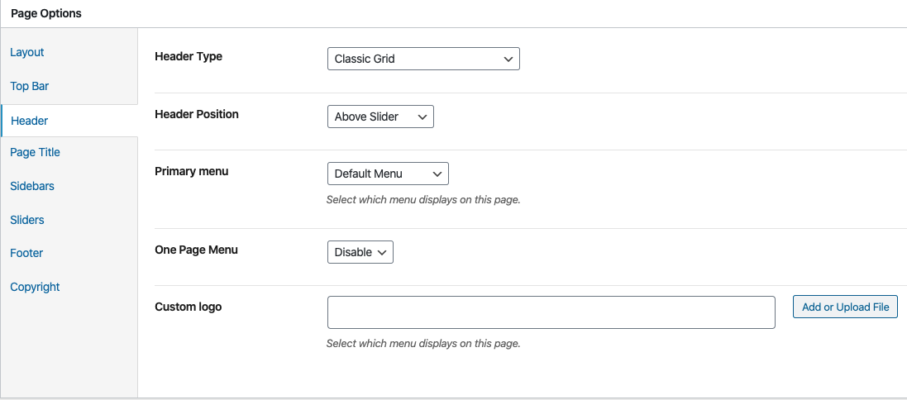

# Page Options

On each page you'll see a **Page Options** metabox, located below the page content editor. This metabox includes various options to control the header style, header position and footer visibility on each page.

> Note: Settings in meta box will be prioritized over settings in the Customize section.