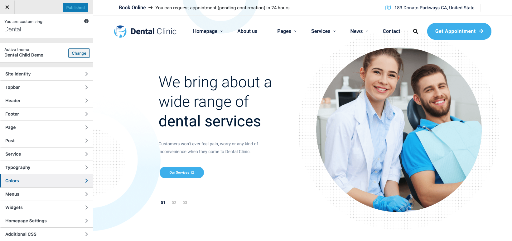

# Customizer

To access the live Theme Customizer, navigate to **WP Dashboard > Appearance > Customize**

### Theme Options

There are hundreds of theme options within Dental to let you modify colors, theme elements (headers, footers, etc), sizes, positioning, fonts, page, post and service.

> Note: Settings in meta box will be prioritized over settings in the Customize section.
