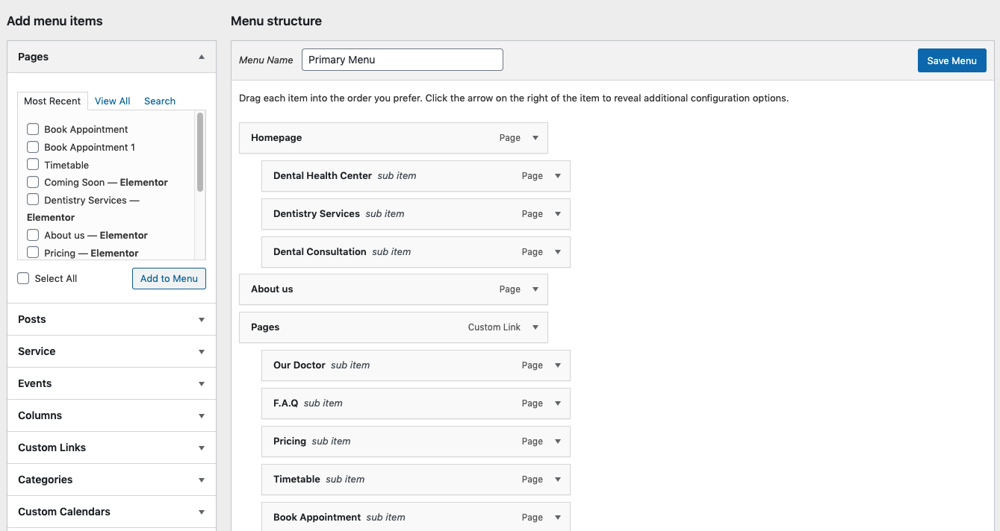
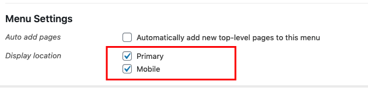

# Navigation

It is rather important to set your theme menu in the WordPress Dashboard. To do this, locate the Menu options by selecting the “Appearance” tab from the dashboard sidebar and then “Menus”.

Once you’re viewing the Menus, create a new menu and save it. After you’ve saved the menu, you can add it to a menu via the Menu Settings, below the Menu Structure area. Add your pages and links to the menu you just created in the Menu Structure area.

> Note: In Dental theme, we use 2 types of location menus: Menu Primary (this menu is for PCs, laptops) and Mobile Menu ( this menu is for mobile phones, tablets). You need to choose the appropriate location for each type.

