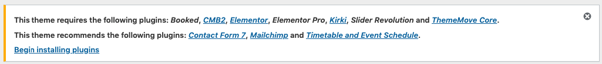
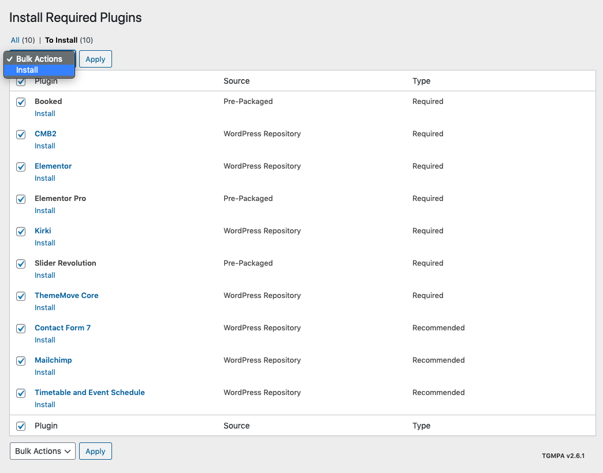
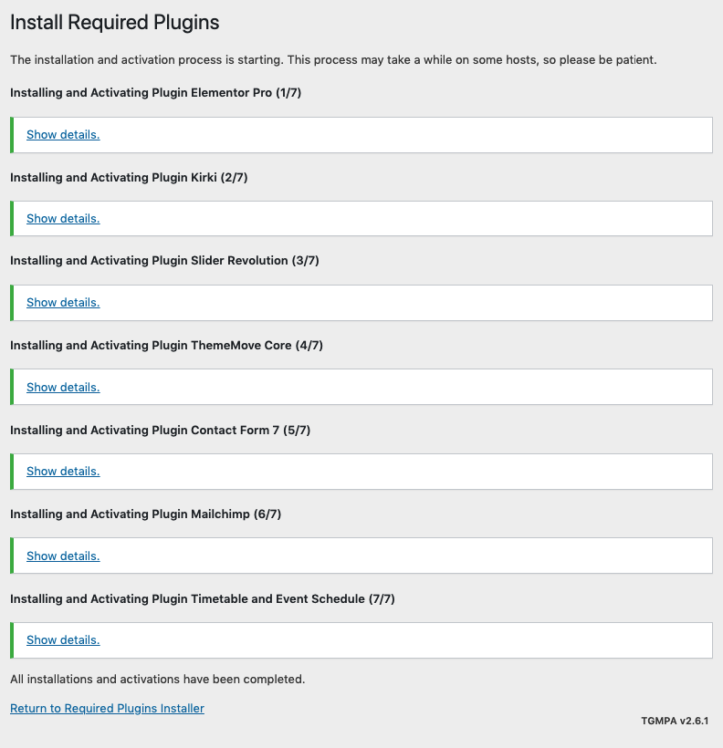

# Plugin Installation

> Required Plugins:[Booked](https://codecanyon.net/item/booked-appointments-appointment-booking-for-wordpress/9466968), [ThemeMove Core](https://wordpress.org/plugins/thememove-core/), [CMB2](https://wordpress.org/plugins/cmb2/), [Kirki](https://wordpress.org/plugins/kirki/), [Elementor](https://elementor.com/), [Elementor Pro](https://elementor.com/), [Slider Revolution](https://codecanyon.net/item/slider-revolution-responsive-wordpress-plugin/2751380) and **Dental Addons** 
> Recommended Plugins: [Contact Form 7](https://wordpress.org/plugins/contact-form-7/), [Timetable and Event Schedule](https://wordpress.org/plugins/mp-timetable/), [MailChimp for WordPress](https://wordpress.org/plugins/mailchimp-for-wp/)

After activating Dental, you will see this notice:

Click **Begin installing plugins**. You will be navigated to **Install Required Plugins** page.

Simply check all of them (or all of required plugins and some recommended plugins you like) and from the drop down select **Install**, then hit **Apply**.

When finishing, it should look like this:

