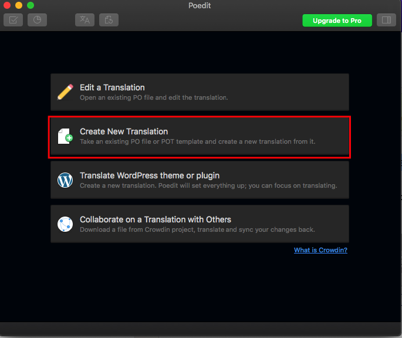
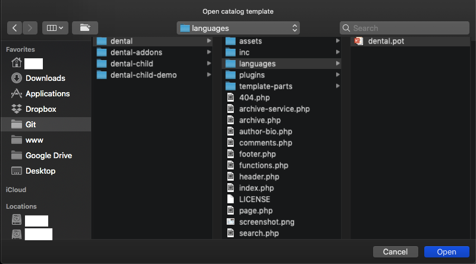
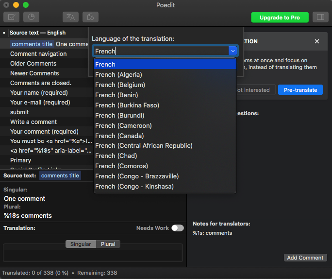
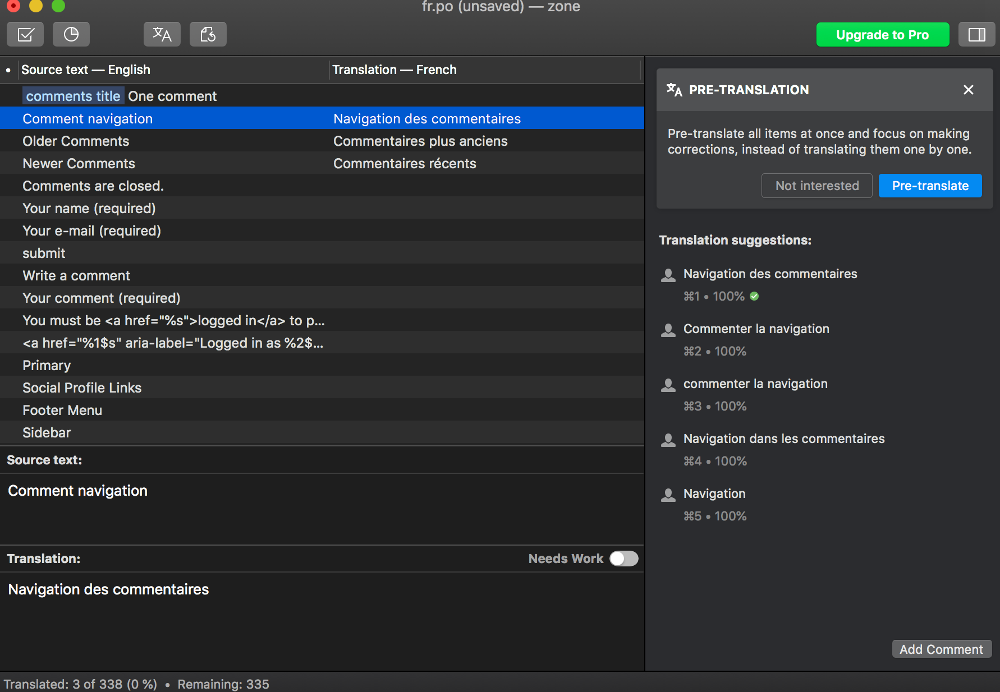
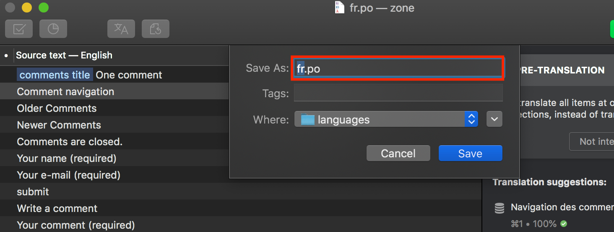
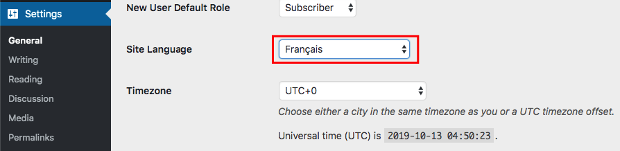
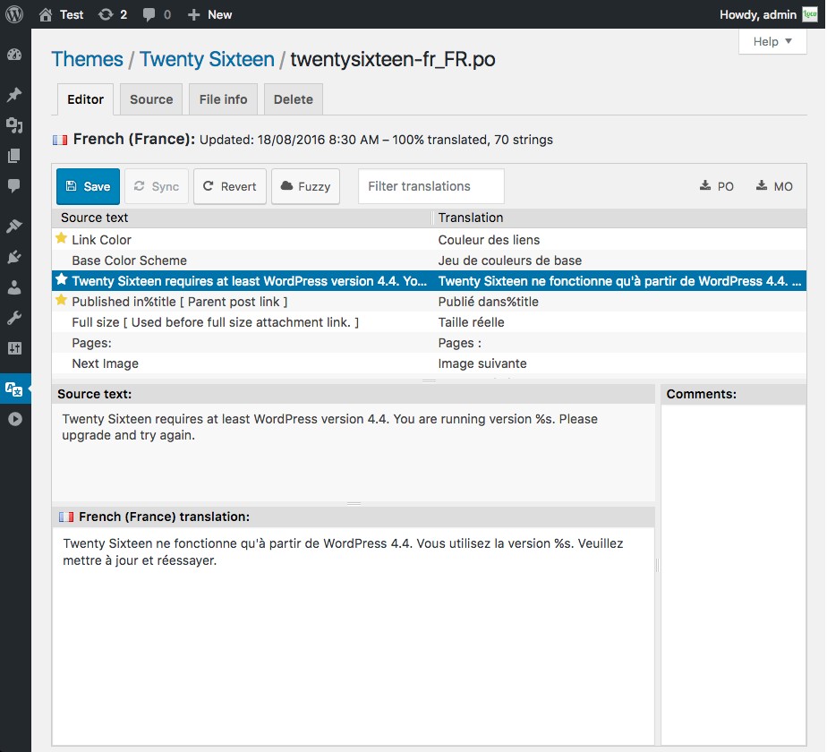

# Theme Localization

With our theme you can translate your site to any language or even multiple languages, it is 100% translation ready theme. 
This theme is localized, which means it can easily be translated in your own language (easy but quite time consuming). There are two ways to translate this theme: use [Poedit](https://poedit.net/) or [Loco Translate](https://wordpress.org/plugins/loco-translate/).

## Poedit
Poedit software installed on your computer. Poedit is available on OS X and Windows and can be downloaded [from here](https://poedit.net/).

##### Step 1: Opening Your Theme’s Default Language Template

Open **Poedit** and select **Create new translation:**

A new window will pop up, select WordPress theme you want to translate. A Theme’s default translation template is located in `wp-content/themes/THEMEXXX/languages/THEMEXXX.pot`, where `THEMEXXX` is the name of your theme.

For example, `wp-content/themes/dental/languages/dental.pot`

Next, from a dropdown menu select a language you want to translate your theme to:

You are ready to translate your theme now.

---
##### Step 2: Translating Your Theme
Highlight any string you want to translate, and enter a desired translation of the source string in the translation section:

Once you have translated your theme, save the file (`fr` in this example) in the same directory as the original template:

---
##### Step 3 — Changing Your WordPress Website Language

To change the site language to one of the pre-installed languages, log in to your WordPress dashboard and go to **Settings > General**. In the **Site Language** dropdown list, select the language you want to use, then click **Save Changes**.

✅ All done! Your website is translated into your language.

## Loco Translate
Loco Translate provides in-browser editing of WordPress translation files. You can follow their [Beginner's guide](https://localise.biz/wordpress/plugin/beginners) to translate the theme into your language.

