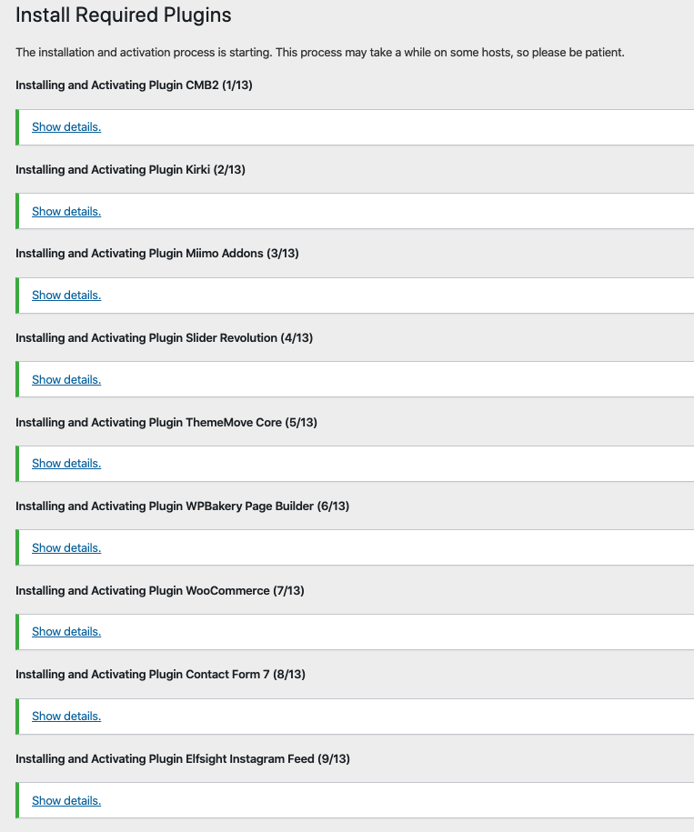

# Plugin Installation

> Required Plugins: [ThemeMove Core](https://wordpress.org/plugins/thememove-core/), [CMB2](https://wordpress.org/plugins/cmb2/), [Kirki](https://wordpress.org/plugins/kirki/), **Miimo Addons**, [WPBakery Page Builder](https://codecanyon.net/item/visual-composer-page-builder-for-wordpress/242431?ref=ThemeMove), [Slider Revolution](https://codecanyon.net/item/slider-revolution-responsive-wordpress-plugin/2751380), [WooCommerce](https://wordpress.org/plugins/woocommerce/) 
> Recommended Plugins: [Contact Form 7](https://wordpress.org/plugins/contact-form-7/), [Elfsight Instagram Feed](https://codecanyon.net/item/instagram-feed-wordpress-gallery-for-instagram/13004086?ref=ThemeMove), [MailChimp for WordPress](https://wordpress.org/plugins/mailchimp-for-wp/), [Smart Compare](https://wordpress.org/plugins/woo-smart-compare/), [Smart Quickiview](https://wordpress.org/plugins/woo-smart-quick-view/), [Smart Wishlist](https://wordpress.org/plugins/woo-smart-wishlist/)

After activating Miimo, you will see this notice:

Click **Begin installing plugins**. You will be navigated to **Install Required Plugins** page.

Simply check all of them (or all of required plugins and some recommended plugins you like) and from the drop down select **Install**, then hit **Apply**.

When finishing, it should look like this:

