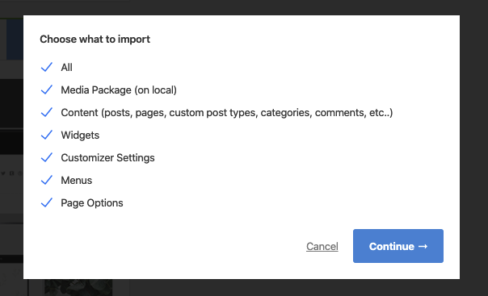

# Demo Installation

!> **You have to [activate your license key](theme-license.md) before importing the demo data.**

Our demo data import lets you have the whole data package in minutes, delivering all kinds of essential things quickly and simply. All you need to do is to navigate to **ThemeMove Core > Import Demo Data**. Hit **Import Demo Data**.

---
Select the content to import

Have a cup of coffee. The process is within minutes.

When finishing, it should look like this:

!> After the demo data is installed successfully, you should use the [Regenerate Thumbnails](https://wordpress.org/plugins/regenerate-thumbnails/) plugin to regenerate all thumbnail sizes to make sure that everything works fine.