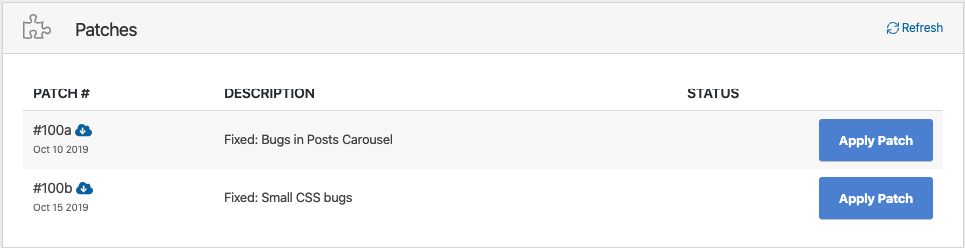

# Apply Patch

This innovative tool allows our development team to deploy fixes and improvements to all theme without the need for our team to prepare and release a full theme update.

All patches are applied at the click of a button, sequentially, without the need for the user to manually apply the patch on the web server.

## Automatic Apply Patches

> You have to [activate your license key](theme-ls.md) before applying patches.

**Step 1:** Navigate to **ThemeMove Core > Update**, there you’ll find the ThemeMove Patcher box. All available patches for the theme will be listed and have a patch number, a tag for the product it’s for, description, and a status stating whether it has been applied or not.

**Step 2:** Click the **Apply Patch** button, starting at the top (patches are applied sequentially). All necessary changes will be automatically applied to the theme files for you.

**Step 3:** Once the patch is applied, you will see a green check mark in the Status column that confirms the patch was applied.

## If Patches Cannot Be Applied Automatically

> If you are not on the latest version of Zone version, simply update your theme. The patches will be in the latest version.

Sometimes server setups are very particular about file/folder permissions and do not allow files to be automatically written to them. In these cases, applying an automatic patch will not work. If your server doesn’t allow the patches to be applied automatically through ThemeMove Core, you can download the patch files and manually apply the fix with FTP access. The reasons why this might happen are listed below, please contact your host and give them these details and ask them to change it for you:

- Theme & plugins should be owned by the web server user (usually www-data)
- Files & folders should have the right permissions. Details on https://wordpress.org/support/article/changing-file-permissions/
- WordPress should be able to write to the filesystem.

## Applying Patches Manually

If your server doesn’t allow the patches to be applied automatically through ThemeMove Core, you can download the patch files and manually apply the fix with FTP access. Just click on the download icon next to the patch ID.

**Step 1:** The patch file will be a .zip file with the patch’s number as its name is the patch ID.

**Step 2:** Now that you’ve found your patch file, extract the .zip file.

**Step 3:** Locating the Patched Files – The extracted folder will be the same path you’ll need to follow to find the files on your site for applying the updated files.

**Step 4:** Upload Fixes – Now access your site through FTP and navigate to the same location your patched files were found in the patch download. Transfer your new patched files (and only the files themselves) to the directory and choose to “overwrite” the existing files.