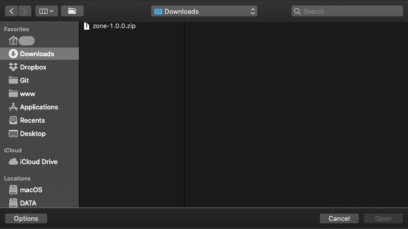
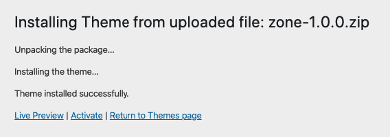
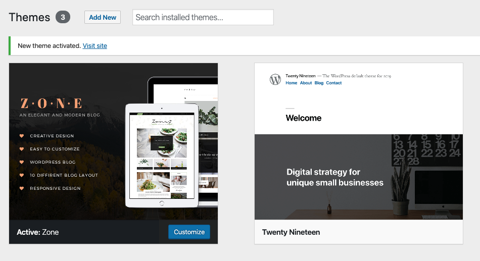

# Theme Installation

## Install theme via WordPress

**Step 1:** Navigate to **Appearance > Themes**

---
**Step 2:** Click **Add New**, then click **Upload Theme > Choose File**

---
**Step 3:** Navigate to the .zip file on your computer, then click **Install Now**

---
**Step 4:** When the installation complete, click Activate. You will be redirected to Themes page with Zone activated.

## Install theme via FTP
- **Step 1** – Log into your server installation via FTP. You can use software such as [Filezilla](https://filezilla-project.org/) for this.
- **Step 2** – Unzip zip file package you have downloaded from the Downloads page. The file name will be *theme-name-x.x.x.zip* (x.x.x is the version of the theme).
- **Step 3** – Upload the extracted Zone folder to the **wp-content > themes** folder on your server. Make sure the folder name is **zone**.
- **Step 4** – Log in to your WordPress Dashboard and navigate to **Appearance > Themes** and clicking the **Activate** button, for the Zone theme.