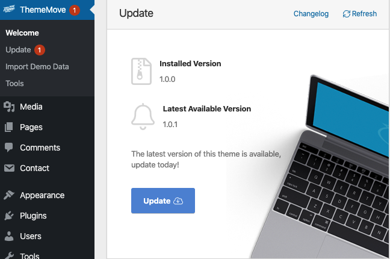
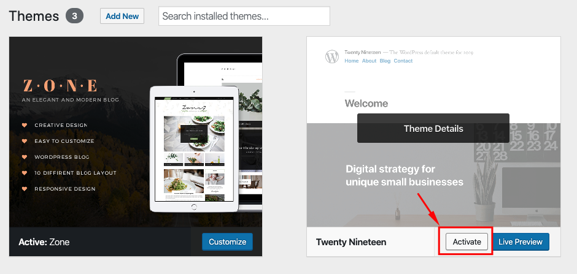
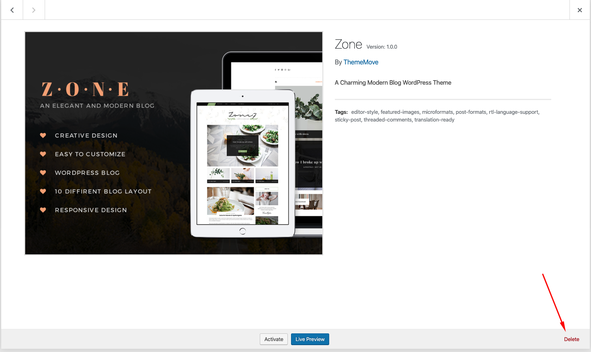

# Update theme

## Automatic Update

> You have to [activate your license key](theme-license.md) before updating the theme.

Navigate to **ThemeMove Core > Welcome**

or **ThemeMove Core > Update**

---
All that's left to do is simply click on the **Update** button and wait for ThemeMove Core to help you.

## Manual Update

**Step 1:** You need to deactivate the current Amely theme in **Appearance > Themes** section by simply activating a different theme. Once you activate a different theme, you can delete the Zone.

---
**Step 2:** [Download the latest version](download-theme.md) from your ThemeMove account

**Step 3:** Then simply upload and activate the theme file in the **Appearance > Themes** section like you've done when [installing theme](theme-installation.md#install-theme-via-wordpress).