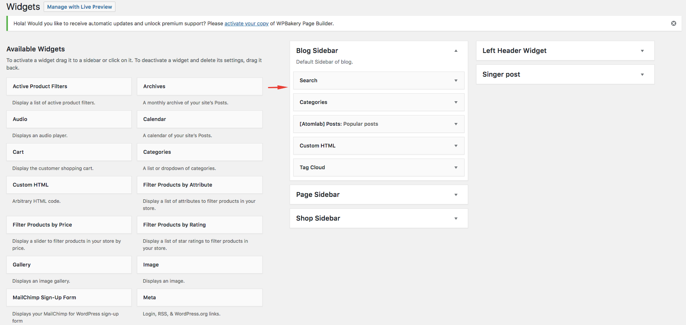

# Widgets

The following widgets are provided in the Zone WordPress Theme

- About Me Widget\
  
- Recent Posts\
  

### Using the Widgets
To employ a widget, simply go to your Widgets editor (located in your WordPress Dashboard in the **Appearance** menu) and drag your widgets into the specified widget areas.

